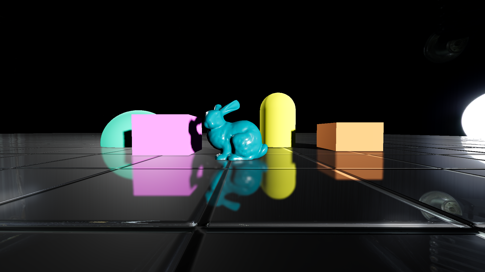

# Godot-SSPR
为Godot 4 实现的屏幕空间屏幕反射(Screen Space Planar Reflections),支持Forward+,Mobile

实现思路感兴趣可查阅知乎文章：[Godot 4 实现屏幕空间平面反射(SSPR)|知乎](https://zhuanlan.zhihu.com/p/1986834836032348814)
## 介绍
项目初衷是为了在Godot中实现可在Forward+和Mobile渲染器上低成本运行的屏幕空间平面反射效果。  

特点：
+ 支持Forward+,Mobile
+ 邻域搜索填补空洞
+ 手动实现TAA进一步填补反射空洞（因为Mobile不能启用内置TAA）
+ 边缘消隐
+ 附带Dual Kawase blur和gaussian blur处理效果
  
实际运行耗时（在RTX 5060ti上测试，1080P分辨率）：  
+ 不开启模糊的情况下：
  + Forward+ : GPU耗时0.6~0.7ms。
  + Mobile : GPU耗时0.4~0.5ms。
+ 开启模糊（Dual Kawase blur）的情况下：
  + Forward+ : GPU耗时0.9~1ms。
  + Mobile : GPU耗时0.6~0.7ms。  
  
移动端实机测试(使用测试场景)：  
+ 小米11（骁龙888）,1080P,开启模糊（Dual Kawase blur）, Avg FPS : 42。
+ IQOO 15 (骁龙8 Elite Gen 5), 1080P, 开启模糊（Dual Kawase blur）, Avg FPS : 120。

项目文件目录：

+ `Material` 文件夹：使用SSR方法作为反射shader的地面材质（仅作比较测试）

+ `Mesh` 文件夹：包含测试用的网格模型
  
+ `Scene` 文件夹：测试用的主场景文件以及利用相机射线方法重建世界空间位置的测试场景
  
+ `Script` 文件夹：包含自由相机脚本，用于测试相机射线方法重建世界空间位置脚本
  
    自由相机操作方法：
    + WASD：前后左右移动相机
    + 鼠标移动：旋转相机
    + 鼠标中键：显示隐藏鼠标指针
    + QE：上下移动相机
    + ESC：退出运行场景
  
+ `shader` 文件夹：包含利用相机射线方法重建世界空间位置shader以及使用SSR方法作为反射shader的地面材质的shader
  
+ `SSPR_demo` 文件夹：
    + `Compute Shader` 文件夹：包含所有计算反射，TAA，模糊后处理的Compute Shader
    + `GDScript` 文件夹：SSPR效果的合成器后处理脚本
    + `shader` 文件夹：SSPR方法作为反射shader的shader
  
+ `World` 文件夹：包含环境贴图资源

## 用法

+ 使用Godot 4.5.1 打开项目（或更高版本）。

## 参考

#### SSPR架构
+ https://remi-genin.github.io/posts/screen-space-planar-reflections-in-ghost-recon-wildlands/
+ https://zhuanlan.zhihu.com/p/651134124
#### TAA参考
+ https://blog.51cto.com/u_16213647/8761628
#### Dual Kawase Blur参考
+ https://github.com/QianMo/X-PostProcessing-Library/tree/master/Assets/X-PostProcessing/Effects/DualKawaseBlur
+ https://loveforyou.tech/posts/urp-dual-kawase-blur/
#### Godot合成器功能代码参考
+ https://github.com/BastiaanOlij/RERadialSunRays/blob/master/radial_sky_rays/radial_sky_rays.gd
